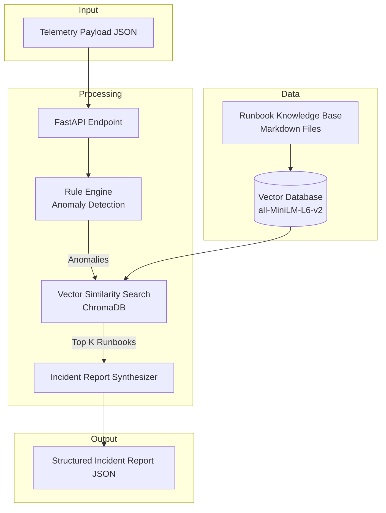

# AI-Powered IT Operations Assistant

[](https://www.python.org/downloads/)
[](https://fastapi.tiangolo.com/)
[](https://www.langchain.com/)
[](https://www.trychroma.com/)
[](https://huggingface.co/)
[](https://www.docker.com/)
[](https://docs.pytest.org/)
[](https://opensource.org/licenses/MIT)

---

## 📋 Table of Contents

- [Overview](#overview)
- [Use Cases](#use-cases)
- [Architecture](#architecture)
- [Key Features](#key-features)
- [Technology Stack](#technology-stack)
- [Repository Structure](#repository-structure)
- [Getting Started](#getting-started)
  - [Prerequisites](#prerequisites)
  - [Local Setup](#local-setup)
  - [Running with Docker](#running-with-docker)
- [Configuration](#configuration)
- [Sample Payload & Output](#sample-payload--output)
- [Testing](#testing)
- [Monitoring & Observability](#monitoring--observability)
- [Deployment](#deployment)
- [Roadmap](#roadmap)
- [Contributing](#contributing)
- [License](#license)
- [Contact](#contact)

---

## 📖 Overview

An **automated AIOps incident triage engine** built with FastAPI, LangChain, ChromaDB, and Pydantic. The platform ingests real-time infrastructure telemetry (CPU, RAM, Disk, process health, HTTP status), identifies active system anomalies, and performs vector similarity search against operational runbooks to synthesize structured incident reports.

This system transforms raw infrastructure metrics into actionable intelligence, reducing Mean Time to Detection (MTTD) and Mean Time to Resolution (MTTR) by automating the initial incident analysis and remediation recommendation process.

**Key Differentiators**:
- **Zero‑configuration RAG**: Pre‑indexed runbook knowledge base with embeddings for instant retrieval.
- **Strongly Typed Incident Reports**: Pydantic‑enforced schemas ensure consistent output for downstream automation.
- **Container‑Native**: Full Docker support with a lightweight Python 3.11 base image.
- **Extensible Rule Engine**: Easily add custom threshold rules and anomaly detection logic.

---

## 🎯 Use Cases

- **Infrastructure Monitoring**: Automatically analyze telemetry from servers, containers, or cloud instances.
- **On‑Call Support**: Provide first‑line incident context and recommended actions to SREs.
- **Runbook Automation**: Retrieves relevant operational procedures and presents them in a structured format.
- **AIOps Playground**: A reference implementation for integrating RAG into IT operations workflows.
- **Self‑Healing Systems**: Feed the structured output into automated remediation pipelines (e.g., Ansible, Kubernetes operators).

---

## 🏗️ Architecture



### Data Flow

| Stage | Component | Description |
|-------|-----------|-------------|
| **Ingestion** | FastAPI Endpoint | Receives telemetry payload via POST `/api/v1/telemetry/analyze`. |
| **Anomaly Detection** | Rule Engine | Evaluates metrics against defined thresholds; flags violations and service failures. |
| **Context Retrieval** | ChromaDB + LangChain | Embeds anomaly signatures and retrieves top‑matching runbooks. |
| **Report Synthesis** | Incident Synthesizer | Combines anomaly data and runbook context into a structured JSON incident report. |
| **Output** | Incident Report | Returns severity, root cause, recommended actions, escalation path, and sources. |

---

## ⚡ Key Features

### 🔍 Automated Anomaly Detection
- Monitors **CPU, RAM, Disk, service health**, and **HTTP endpoints**.
- Configurable threshold rules (e.g., CPU > 90% triggers a **HIGH** severity alert).
- Flags both threshold violations and service failures instantly.

### 📚 RAG-Powered Runbook Retrieval
- Embeds anomaly signatures using `all-MiniLM-L6-v2` via HuggingFace Transformers.
- Stores and retrieves operational runbooks using **ChromaDB** vector store.
- Returns the most relevant procedures with similarity scores for transparency.

### 📋 Structured Incident Reports
- Strongly typed schemas using **Pydantic v2**.
- Includes: incident title, severity, likely cause, recommended actions, escalation criteria, and sources consulted.
- Predictable, machine‑readable output for integration with ticketing systems (Jira, ServiceNow) or automation tools.

### 🐳 Container‑Ready
- Optimized Dockerfile with multi‑stage builds.
- `docker-compose` support for local development and testing.
- Minimal dependencies for a lightweight footprint.

### 🧪 Test Coverage
- Comprehensive `pytest` suite covering the rule engine, RAG retrieval, and API endpoints.
- Sample telemetry payloads provided for manual testing.

---

## 🛠️ Technology Stack

| Category | Technology | Version |
|----------|------------|---------|
| **Language** | Python | 3.11 |
| **Web Framework** | FastAPI | 0.115+ |
| **Data Validation** | Pydantic | 2.0+ |
| **Vector Database** | ChromaDB | 0.5+ |
| **LLM Framework** | LangChain | 0.3+ |
| **Embeddings** | HuggingFace `all-MiniLM-L6-v2` | - |
| **Testing** | Pytest, HTTPX | 7.0+ |
| **Containerization** | Docker, Docker Compose | - |

---

## 📁 Repository Structure

```plaintext
ai-it-ops-assistant/
│
├── app/
│   ├── __init__.py
│   ├── main.py                 # Application entry point
│   │
│   ├── api/                    # Route handlers & endpoints
│   │   ├── __init__.py
│   │   └── routes.py
│   │
│   ├── config/                 # Environment & metric threshold configuration
│   │   ├── __init__.py
│   │   └── settings.py
│   │
│   ├── engine/                 # Anomaly & rule evaluation engine
│   │   ├── __init__.py
│   │   └── rules.py
│   │
│   ├── models/                 # Pydantic data schemas
│   │   ├── __init__.py
│   │   ├── telemetry.py
│   │   └── incident.py
│   │
│   ├── rag/                    # Vector database & runbook search
│   │   ├── __init__.py
│   │   ├── vector_store.py
│   │   └── retriever.py
│   │
│   └── services/               # Incident report synthesizer
│       ├── __init__.py
│       └── synthesizer.py
│
├── data/
│   ├── runbooks/               # Operational Markdown runbooks
│   │   ├── disk_and_webserver.md
│   │   └── network_issues.md
│   └── telemetry_samples/      # Sample payloads for testing
│       └── sample_payload.json
│
├── tests/                      # Automated test suite
│   ├── __init__.py
│   ├── test_engine.py
│   ├── test_rag.py
│   └── test_api.py
│
├── .env.example                # Environment variables template
├── .gitignore
├── Dockerfile
├── docker-compose.yml
├── requirements.txt
├── pyproject.toml              # Black/isort configuration
└── README.md
```

---

## 🚀 Getting Started

### Prerequisites

- **Python** 3.11 or higher
- **pip** (Python package manager)
- **Git** (for cloning)
- (Optional) **Docker Desktop** for containerized execution

### Local Setup

1. **Clone the repository**

   ```bash
   git clone https://github.com/YOUR_USERNAME/ai-it-ops-assistant.git
   cd ai-it-ops-assistant
   ```

2. **Create and activate a virtual environment**

   ```bash
   python -m venv .venv
   ```

   **Windows (PowerShell):**
   ```powershell
   .\.venv\Scripts\Activate.ps1
   ```

   **macOS / Linux:**
   ```bash
   source .venv/bin/activate
   ```

3. **Install dependencies**

   ```bash
   pip install --upgrade pip
   pip install -r requirements.txt
   ```

4. **Configure environment** (optional)

   ```bash
   cp .env.example .env
   ```

   Edit `.env` to adjust thresholds (e.g., `CPU_THRESHOLD_HIGH=85.0`).

5. **Run the API server**

   ```bash
   python -m app.main
   ```

   The interactive API documentation will be available at [http://127.0.0.1:8000/docs](http://127.0.0.1:8000/docs).

### Running with Docker

```bash
docker compose up --build
```

The API will be exposed on port `8000` as defined in the `docker-compose.yml`.

---

## ⚙️ Configuration

The system uses environment variables (loaded from `.env` if present) for runtime configuration:

| Variable | Description | Default |
|----------|-------------|---------|
| `CPU_THRESHOLD_HIGH` | CPU utilization percentage for HIGH severity | `85.0` |
| `CPU_THRESHOLD_CRITICAL` | CPU utilization percentage for CRITICAL severity | `95.0` |
| `RAM_THRESHOLD_HIGH` | RAM utilization percentage for HIGH severity | `80.0` |
| `DISK_THRESHOLD_CRITICAL` | Disk utilization percentage for CRITICAL severity | `90.0` |
| `VECTOR_STORE_PATH` | Path to ChromaDB persistence directory | `./data/vector_store` |
| `RUNBOOKS_PATH` | Path to the Markdown runbooks directory | `./data/runbooks` |
| `EMBEDDING_MODEL` | HuggingFace embedding model name | `all-MiniLM-L6-v2` |
| `TOP_K_RESULTS` | Number of runbooks to retrieve | `3` |

---

## 📊 Sample Payload & Output

### Request

**POST** `/api/v1/telemetry/analyze`

```json
{
  "cpu_percent": 94.0,
  "ram_percent": 91.0,
  "disk_percent": 97.0,
  "services": { "apache2": "DOWN" },
  "http_endpoints": { "https://app.internal/health": 503 }
}
```

### Response

```json
{
  "incident_title": "Incident: Infrastructure Degradation (High CPU utilization: 94.0%, High RAM utilization: 91.0%)",
  "severity": "CRITICAL",
  "likely_cause": "Detected 5 system anomaly/anomalies: High CPU utilization: 94.0%; High RAM utilization: 91.0%; Critical Disk utilization: 97.0%; Service outage: apache2 is DOWN; Endpoint failure: https://app.internal/health returned HTTP 503.",
  "recommended_actions": [
    "Inspect system and application logs under /var/log for critical errors.",
    "Verify process states and resource consumption using system diagnostic tools.",
    "Identify and remove/rotate large log files to free up disk capacity.",
    "Attempt service restart for: apache2"
  ],
  "escalation_required": true,
  "escalation_criteria": "Escalate to On-Call Infrastructure Team if service recovery fails after automated actions or disk usage remains >95%.",
  "sources_consulted": [
    {
      "title": "disk_and_webserver.md",
      "file_path": "data/runbooks/disk_and_webserver.md",
      "relevance_score": 0.58
    }
  ]
}
```

### cURL Example

```bash
curl -X POST http://localhost:8000/api/v1/telemetry/analyze \
  -H "Content-Type: application/json" \
  -d '{
    "cpu_percent": 94.0,
    "ram_percent": 91.0,
    "disk_percent": 97.0,
    "services": {"apache2": "DOWN"},
    "http_endpoints": {"https://app.internal/health": 503}
  }'
```

---

## 🧪 Testing

The project includes a comprehensive test suite using `pytest` and `httpx`.

```bash
# Run all tests with verbose output
pytest -v

# Run specific test file
pytest tests/test_engine.py -v

# Run tests with coverage report
pytest --cov=app --cov-report=html

# Run linting (if configured)
black --check app/ tests/
isort --check-only app/ tests/
```

---

## 📊 Monitoring & Observability

- **Health Check**: The API provides a `/health` endpoint for liveness and readiness probes.
- **Structured Logging**: Logs are output in JSON format for easy ingestion into logging stacks (ELK, Splunk).
- **OpenTelemetry Integration**: (Planned) Distributed tracing support for performance analysis.

---

## 🚢 Deployment

### Production Considerations

1. **Scale Vector Store**: For large runbook collections, consider using a remote ChromaDB instance or migrating to Pinecone/Weaviate.
2. **Embedding Cache**: Cache embeddings to reduce inference time on repeated queries.
3. **API Security**: Add authentication (JWT or API keys) and rate limiting for production endpoints.
4. **Database Backend**: Replace the local ChromaDB with a persistent remote store.

### Kubernetes Deployment

A sample Kubernetes manifest is available in the `deploy/` directory. Use the provided Docker image with your preferred registry.

---

## 🗺️ Roadmap

- [ ] Add **LLM-augmented generation** (e.g., GPT‑4, Mistral) for more fluent incident summaries.
- [ ] Integrate **Slack/Teams** alerting for incident notifications.
- [ ] Implement **time‑series anomaly detection** (e.g., Prophet, statistical models).
- [ ] Add **self‑healing actions** via Ansible or Terraform.
- [ ] Support for **multi‑tenant** configurations.
- [ ] Web‑based dashboard for historical incident analysis.

---

## 🤝 Contributing

Contributions are welcome! Please follow these steps:

1. Fork the repository.
2. Create a feature branch (`git checkout -b feature/amazing-feature`).
3. Commit your changes (`git commit -m 'Add amazing feature'`).
4. Push to the branch (`git push origin feature/amazing-feature`).
5. Open a Pull Request.

### Development Guidelines

- Follow **PEP 8** style guidelines.
- Write **docstrings** for all functions and classes.
- Add **unit tests** for new functionality.
- Ensure all tests pass before submitting a PR.

---

## 📄 License

This project is licensed under the MIT License – see the [LICENSE](LICENSE) file for details.

---

## 📧 Contact

**Author**: Muhammad Baqir  
**GitHub**: [github.com/YOUR_USERNAME](https://github.com/baqir110)  
**LinkedIn**: [Muhammad Baqir](https://linkedin.com/in/muhammad-baqir-it)

---

<p align="center">
  Made with ❤️ and 🐍 Python
</p>

<p align="center">
  ⭐ Star this repository if you find it useful!
</p>
