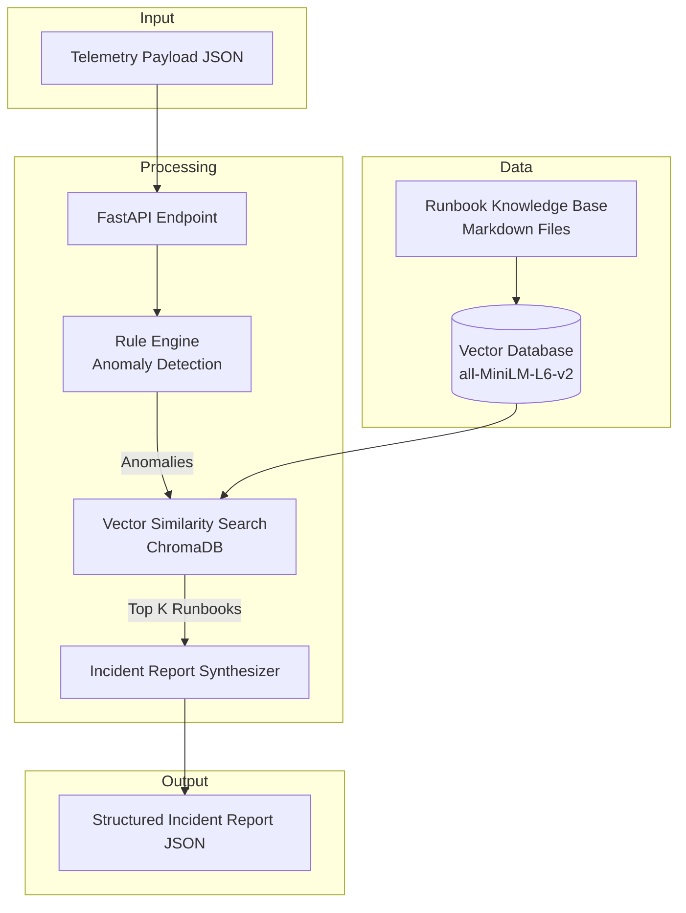

# AI-Powered IT Operations Assistant

[](https://www.python.org/downloads/)
[](https://fastapi.tiangolo.com/)
[](https://www.langchain.com/)
[](https://www.trychroma.com/)
[](https://huggingface.co/)
[](https://www.docker.com/)
[](https://docs.pytest.org/)
[](https://opensource.org/licenses/MIT)

---

## Table of Contents

- [Overview](#overview)
- [Use Cases](#use-cases)
- [Architecture](#architecture)
- [Key Features](#key-features)
- [Technology Stack](#technology-stack)
- [Repository Structure](#repository-structure)
- [Getting Started](#getting-started)
  - [Prerequisites](#prerequisites)
  - [Quick Start with Docker](#quick-start-with-docker)
  - [Building the Docker Image](#building-the-docker-image)
  - [Local Development](#local-development)
- [Configuration](#configuration)
- [Local Dashboard Access](#local-dashboard-access)
- [Sample Payload & Output](#sample-payload--output)
- [Testing](#testing)
- [Monitoring & Observability](#monitoring--observability)
- [Deployment](#deployment)
- [Roadmap](#roadmap)
- [Contributing](#contributing)
- [License](#license)
- [Contact](#contact)

---

## Overview

An automated AIOps incident triage engine built with FastAPI, LangChain, ChromaDB, and Pydantic. The system ingests real‑time infrastructure telemetry (CPU, RAM, disk, process health, HTTP status), detects system anomalies, and performs vector similarity search against operational runbooks to produce structured incident reports.

The service reduces Mean Time to Detection (MTTD) and Mean Time to Resolution (MTTR) by automating initial analysis and providing actionable recommendations.

Key differentiators:

- **Zero‑configuration RAG**: Pre‑indexed runbook knowledge base with embeddings for instant retrieval.
- **Strongly typed incident reports**: Pydantic‑enforced schemas for consistent downstream automation.
- **Container‑native**: Full Docker Compose setup with Prometheus and Grafana integration.
- **Extensible rule engine**: Custom threshold rules and anomaly detection logic can be added without code modification.

---

## Use Cases

- **Infrastructure monitoring**: Analyze telemetry from servers, containers, or cloud instances.
- **On‑call support**: Provide SREs with immediate incident context and recommended remediation actions.
- **Runbook automation**: Retrieve relevant operational procedures in a structured format.
- **AIOps reference architecture**: Demonstrate integration of RAG into IT operations workflows.
- **Self‑healing systems**: Feed structured outputs into automated remediation pipelines (Ansible, Kubernetes operators).

---

## Architecture



Data Flow

Stage Component Description
Ingestion FastAPI Endpoint Accepts telemetry via POST /api/v1/telemetry/analyze.
Anomaly detection Rule Engine Evaluates metrics against thresholds; flags violations and service failures.
Context retrieval ChromaDB + LangChain Embeds anomalies and retrieves matching runbooks.
Report synthesis Incident Synthesizer Combines anomalies and runbook context into a structured JSON report.
Output Incident Report Returns severity, root cause, recommended actions, escalation, and sources.

---

Key Features

· Automated anomaly detection: Monitors CPU, RAM, disk, services, and HTTP endpoints with configurable thresholds.
· RAG‑powered runbook retrieval: Embeds anomalies using all-MiniLM-L6-v2 (HuggingFace) and retrieves relevant procedures via ChromaDB.
· Structured incident reports: Pydantic v2 schemas enforce consistent output including title, severity, likely cause, recommended actions, escalation criteria, and sources consulted.
· Container‑ready and monitored: Multi‑service Docker Compose setup (API, PostgreSQL, Redis, Prometheus, Grafana) includes automated Grafana configuration scripts.
· Comprehensive test coverage: pytest suite covers the rule engine, RAG retrieval, and API endpoints.
· External HTTP health checks: Uses httpx to verify downstream service availability.

---

Technology Stack

Category Technology Version
Language Python 3.11+ / 3.13
Web Framework FastAPI 0.115+
Data Validation Pydantic 2.0+
Vector Database ChromaDB 0.5+
LLM Framework LangChain 0.3+
Embeddings HuggingFace all-MiniLM-L6-v2 -
Database & Cache PostgreSQL, Redis -
Monitoring Prometheus, Grafana -
Testing Pytest, HTTPX 7.0+
Containerization Docker, Docker Compose -

---

Repository Structure

```plaintext
ai-it-ops-assistant/
│
├── app/
│   ├── __init__.py
│   ├── main.py                 # Application entry point
│   │
│   ├── api/                    # Route handlers & endpoints
│   │   ├── __init__.py
│   │   └── routes.py
│   │
│   ├── config/                 # Environment & metric threshold configuration
│   │   ├── __init__.py
│   │   └── settings.py
│   │
│   ├── engine/                 # Anomaly & rule evaluation engine
│   │   ├── __init__.py
│   │   └── rules.py
│   │
│   ├── models/                 # Pydantic data schemas
│   │   ├── __init__.py
│   │   ├── telemetry.py
│   │   └── incident.py
│   │
│   ├── rag/                    # Vector database & runbook search
│   │   ├── __init__.py
│   │   ├── vector_store.py
│   │   └── retriever.py
│   │
│   └── services/               # Incident report synthesizer
│       ├── __init__.py
│       └── synthesizer.py
│
├── data/
│   ├── runbooks/               # Operational Markdown runbooks
│   │   ├── disk_and_webserver.md
│   │   └── network_issues.md
│   └── telemetry_samples/      # Sample payloads for testing
│       └── sample_payload.json
│
├── prometheus/
│   └── prometheus.yml          # Prometheus scrape configuration
│
├── tests/                      # Automated test suite
│   ├── __init__.py
│   ├── test_engine.py
│   ├── test_rag.py
│   └── test_api.py
│
├── .env.example                # Environment variables template
├── .gitignore
├── Dockerfile
├── docker-compose.yml
├── pyproject.toml              # Project and linter configuration
├── requirements.txt
├── setup-grafana.ps1           # Windows Grafana setup script
├── setup-grafana.sh            # Linux/macOS Grafana setup script
└── README.md
```

---

Getting Started

Prerequisites

· Python 3.11 or higher (Python 3.13 is also supported)
· pip and git
· Docker Desktop (optional, for containerized execution)

Quick Start with Docker

Run all services with Docker Compose:

1. Set up environment variables
   Copy .env.example to .env in the project root:
   ```bash
   cp .env.example .env
   ```
   Update the configuration inside .env:
   ```env
   OPENAI_API_KEY=your_openai_api_key_here   # Optional – only for LLM‑augmented summaries
   CPU_THRESHOLD_HIGH=85.0
   CPU_THRESHOLD_CRITICAL=95.0
   RAM_THRESHOLD_HIGH=80.0
   DISK_THRESHOLD_CRITICAL=90.0
   VECTOR_STORE_PATH=./data/vector_store
   RUNBOOKS_PATH=./data/runbooks
   EMBEDDING_MODEL=all-MiniLM-L6-v2
   TOP_K_RESULTS=3
   ```
2. Start the stack
   ```bash
   docker compose up -d
   ```
   To force a rebuild of the API image:
   ```bash
   docker compose up --build -d
   ```
3. View logs (optional)
   ```bash
   docker compose logs -f
   ```
4. Configure Grafana (optional)
   · Windows: .\setup-grafana.ps1
   · Linux/macOS: ./setup-grafana.sh

Building the Docker Image

To build only the API image for standalone use:

```bash
docker build -t ai-it-ops:latest .
```

To run the container independently (without the auxiliary services):

```bash
docker run -d -p 8000:8000 --env-file .env ai-it-ops:latest
```

For full monitoring stack functionality, use Docker Compose as described above.

Local Development (without Docker)

1. Clone the repository
   ```bash
   git clone https://github.com/baqir110/ai-it-ops-assistant.git
   cd ai-it-ops-assistant
   ```
2. Create and activate a virtual environment
   ```bash
   python -m venv .venv
   ```
   · Windows (PowerShell): .\.venv\Scripts\Activate.ps1
   · Linux / macOS: source .venv/bin/activate
3. Install dependencies
   ```bash
   pip install --upgrade pip
   pip install -r requirements.txt
   ```
4. Run the API server
   ```bash
   uvicorn app.main:app --reload
   ```
   Interactive Swagger documentation is available at http://127.0.0.1:8000/docs.

---

Configuration

Runtime settings are managed via environment variables in .env:

Variable Description Default
OPENAI_API_KEY Optional; required only for LLM‑augmented summaries. The rule‑based synthesizer functions without it. (empty)
CPU_THRESHOLD_HIGH CPU utilization percentage for HIGH alert 85.0
CPU_THRESHOLD_CRITICAL CPU utilization percentage for CRITICAL alert 95.0
RAM_THRESHOLD_HIGH RAM utilization percentage for HIGH alert 80.0
DISK_THRESHOLD_CRITICAL Disk utilization percentage for CRITICAL alert 90.0
VECTOR_STORE_PATH ChromaDB persistence directory ./data/vector_store
RUNBOOKS_PATH Directory containing Markdown runbooks ./data/runbooks
EMBEDDING_MODEL HuggingFace embedding model name all-MiniLM-L6-v2
TOP_K_RESULTS Number of runbooks to retrieve 3

---

Local Dashboard Access

Service Access URL Default Credentials
Swagger UI http://localhost:8000/docs None
ReDoc http://localhost:8000/redoc None
Prometheus http://localhost:9090 None
Grafana http://localhost:3000 admin / admin (password change required on first login)
PostgreSQL localhost:5432 Configured in .env
Redis localhost:6379 None

---

Sample Payload & Output

Request – POST /api/v1/telemetry/analyze

```json
{
  "cpu_percent": 94.0,
  "ram_percent": 91.0,
  "disk_percent": 97.0,
  "services": { "apache2": "DOWN" },
  "http_endpoints": { "https://app.internal/health": 503 }
}
```

Response

```json
{
  "incident_title": "Incident: Infrastructure Degradation (High CPU utilization: 94.0%, High RAM utilization: 91.0%)",
  "severity": "CRITICAL",
  "likely_cause": "Detected 5 system anomaly/anomalies: High CPU utilization: 94.0%; High RAM utilization: 91.0%; Critical Disk utilization: 97.0%; Service outage: apache2 is DOWN; Endpoint failure: https://app.internal/health returned HTTP 503.",
  "recommended_actions": [
    "Inspect system and application logs under /var/log for critical errors.",
    "Verify process states and resource consumption using system diagnostic tools.",
    "Identify and remove/rotate large log files to free up disk capacity.",
    "Attempt service restart for: apache2"
  ],
  "escalation_required": true,
  "escalation_criteria": "Escalate to On-Call Infrastructure Team if service recovery fails after automated actions or disk usage remains >95%.",
  "sources_consulted": [
    {
      "title": "disk_and_webserver.md",
      "file_path": "data/runbooks/disk_and_webserver.md",
      "relevance_score": 0.58
    }
  ]
}
```

---

Testing

Execute the test suite using pytest:

```bash
# Run all tests
pytest

# Run with verbose output
pytest -v

# Run only engine tests
pytest tests/test_engine.py -v
```

---

Monitoring & Observability

· Prometheus metrics: A scraping endpoint is configured for operational metrics collection.
· Grafana dashboards: Setup scripts (Windows and Linux/macOS) are provided to pre‑configure dashboards.
· Health checks: The API exposes a /health endpoint for container liveness and readiness probes.

---

Deployment

· Persistent vector database: Attach dedicated storage volumes for ChromaDB in production deployments.
· Security and secrets: Use environment variables for secrets and terminate HTTPS via a reverse proxy.
· Container orchestration: Deploy with Docker Compose or adapt the provided configuration for Kubernetes.

---

Roadmap

· LLM‑augmented incident summary generation for more fluent, human‑like text.
· Slack and Microsoft Teams webhook integration for alerting.
· Automated remediation playbooks (Ansible / Kubernetes).
· Web UI (Streamlit or React) for telemetry submission and incident history visualization.

---

Contributing

1. Fork the repository.
2. Create a feature branch (git checkout -b feature/your-feature).
3. Commit your changes (git commit -m 'Add some feature').
4. Push to the branch (git push origin feature/your-feature).
5. Open a Pull Request.

---

License

Distributed under the MIT License.

---

Contact

Author: Muhammad Baqir
GitHub: github.com/baqir110
