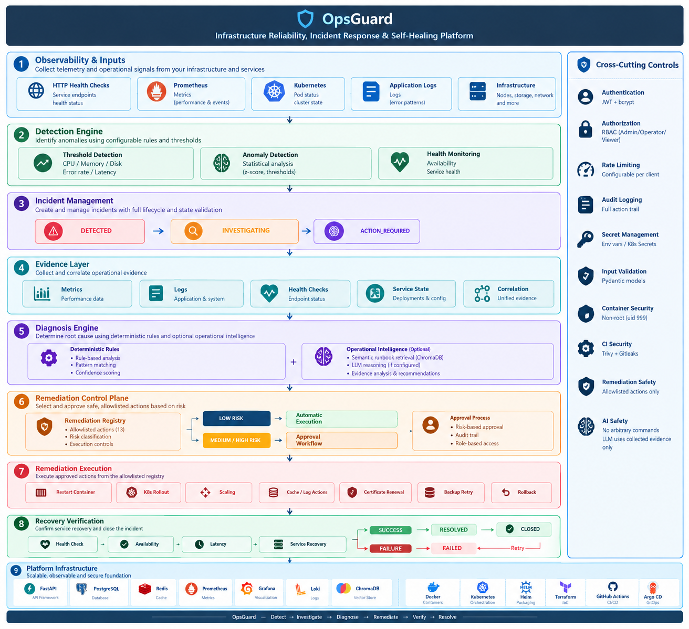

# OpsGuard

**Infrastructure Reliability, Incident Response & Self-Healing Platform**

OpsGuard monitors infrastructure and services, detects operational incidents, correlates telemetry and operational evidence, performs deterministic and evidence-based diagnosis, recommends or executes controlled remediation, verifies recovery, and maintains a complete incident and audit trail.

## Problem

Small and medium-sized organizations often lack dedicated SRE/DevOps teams. When services fail, engineers manually inspect metrics, logs, deployments, and infrastructure state : leading to slow detection, inconsistent response, no audit trail, and repeated incidents.

## Solution

OpsGuard automates the complete incident lifecycle:

* **Monitoring** : HTTP health checks, Prometheus metrics, Kubernetes pod status
* **Detection** : Configurable thresholds for CPU, memory, disk, error rate, and latency
* **Incident Management** : Full lifecycle from DETECTED to CLOSED with state machine validation
* **Evidence Collection** : Automatic gathering of metrics, logs, health checks, and deployment information
* **Diagnosis** : Deterministic rules with optional intelligent analysis over collected evidence
* **Runbook Retrieval** : Semantic search over operational runbooks using ChromaDB
* **Controlled Remediation** : Allowlisted actions only, with risk-based approval workflow
* **Recovery Verification** : Automatic post-remediation health verification
* **Audit Logging** : Complete trail of every action and state change
* **SLO/SLI Monitoring** : Availability, error rate, latency, MTTD, and MTTR tracking

## Core Workflow

```text
Detect → Investigate → Diagnose → Remediate → Verify → Resolve
```

## Architecture

OpsGuard follows a layered reliability architecture designed around continuous observation, deterministic incident handling, controlled remediation, recovery verification, and complete auditability.


```text
┌─────────────────────────────────────────────────────────────────────┐
│                         OpsGuard Platform                           │
├─────────────────────────────────────────────────────────────────────┤
│ API Layer (FastAPI)                                                 │
│ ├── /api/v1/incidents    : Incident CRUD & lifecycle                │
│ ├── /api/v1/services     : Service registry & health                │
│ ├── /api/v1/remediation  : Remediation & approval workflow          │
│ ├── /api/v1/slo          : SLO/SLI definitions & measurements       │
│ ├── /api/v1/cost         : Cost optimization recommendations        │
│ ├── /api/v1/audit        : Audit log                                │
│ └── /api/v1/detection    : Detection events                         │
├─────────────────────────────────────────────────────────────────────┤
│ Domain Layer                                                        │
│ ├── Incident lifecycle state machine (9 states)                     │
│ ├── Severity calculation                                            │
│ └── Audit trail                                                     │
├─────────────────────────────────────────────────────────────────────┤
│ Services Layer                                                      │
│ ├── Detection Engine (HTTP health, Prometheus)                      │
│ ├── Evidence Collector (metrics, logs, health checks, deploys)      │
│ ├── Diagnosis Engine (deterministic + evidence-based analysis)      │
│ ├── Remediation Registry (13 allowlisted actions)                   │
│ ├── Approval Workflow                                               │
│ ├── Recovery Verifier                                               │
│ ├── SLO Calculator                                                  │
│ └── Cost Analyzer                                                   │
├─────────────────────────────────────────────────────────────────────┤
│ Infrastructure Layer                                                │
│ ├── PostgreSQL : Primary data store                                 │
│ ├── Redis : Metric history & rate limiting                          │
│ ├── Prometheus : Metrics collection                                 │
│ ├── Grafana : Visualization & dashboards                            │
│ ├── Loki : Log aggregation                                          │
│ └── ChromaDB : Semantic runbook retrieval                           │
└─────────────────────────────────────────────────────────────────────┘
```

## Self-Healing Workflow

```text
Detection → Incident → Evidence → Diagnosis → Remediation → Verification → Resolution
```

1. **Detection** : HTTP health detector or Prometheus detector identifies an anomaly
2. **Incident** : `IncidentService.process_detection_event()` creates an incident with a unique key
3. **Evidence** : `EvidenceCollector` gathers health checks, detection events, and service information
4. **Diagnosis** : `DiagnosisEngine` analyzes collected evidence using deterministic rules and optional intelligent analysis
5. **Remediation** : Remediation is recommended based on diagnosis; risk level determines approval requirements
6. **Verification** : `RecoveryVerifier` checks HTTP health, availability, and latency
7. **Resolution** : Incident is marked RESOLVED only if verification succeeds

All remediation actions go through the **allowlisted remediation registry**. The intelligence layer cannot execute arbitrary shell commands.

## Operational Intelligence

OpsGuard includes an optional operational intelligence layer that enhances incident analysis while keeping the core execution path deterministic and controlled.

* **Incident Classification** : Events classified by operational type such as `cpu_high` and `http_error_rate`
* **Runbook Retrieval** : Semantic search over operational runbooks using ChromaDB and sentence-transformers
* **Evidence-Based Diagnosis** : Optional external intelligence can analyze collected operational evidence to assist diagnosis
* **Evidence Analysis** : Analysis is grounded in collected evidence rather than unrestricted system access
* **Remediation Recommendation** : Recommendations are restricted to actions available through the allowlisted remediation registry
* **Deterministic Fallback** : The platform remains fully operational using deterministic rules when no external intelligence provider is configured

The intelligence layer assists analysis; it does not control unrestricted infrastructure execution.

## Incident Lifecycle

```text
DETECTED → INVESTIGATING → DIAGNOSED → ACTION_REQUIRED → REMEDIATING → VERIFYING → RESOLVED → CLOSED
                                                                         ↘ FAILED → (retry)
```

| State           | Description                                  |
| --------------- | -------------------------------------------- |
| DETECTED        | Incident created from detection event        |
| INVESTIGATING   | Evidence collection and analysis in progress |
| DIAGNOSED       | Root cause identified with confidence score  |
| ACTION_REQUIRED | Remediation recommended, awaiting approval   |
| REMEDIATING     | Approved remediation executing               |
| VERIFYING       | Post-remediation recovery verification       |
| RESOLVED        | Recovery verified, incident resolved         |
| FAILED          | Remediation did not achieve recovery         |
| CLOSED          | Incident manually closed                     |

## Detectors

| Detector    | Source         | Detects                                                          |
| ----------- | -------------- | ---------------------------------------------------------------- |
| HTTP Health | HTTP endpoints | Connection failures, HTTP 5xx, latency degradation               |
| Prometheus  | Prometheus API | High CPU, high memory, high disk, error rate spikes, p95 latency |

All detectors produce standardized `DetectionEvent` objects and support configurable thresholds.

## Remediation

### Allowlisted Actions

| Action                | Risk   | Approval Required |
| --------------------- | ------ | ----------------- |
| `retry_health_check`  | LOW    | No                |
| `clear_cache`         | LOW    | No                |
| `clear_logs`          | LOW    | No                |
| `restart_container`   | LOW    | No                |
| `refresh_monitoring`  | LOW    | No                |
| `retry_backup`        | LOW    | No                |
| `investigate`         | LOW    | No                |
| `restart_service`     | MEDIUM | Yes               |
| `k8s_rollout_restart` | MEDIUM | Yes               |
| `k8s_scale`           | MEDIUM | Yes               |
| `scale_up`            | MEDIUM | Yes               |
| `renew_certificate`   | MEDIUM | Yes               |
| `rollback_deployment` | HIGH   | Yes               |

Every action is audited with `requested_by`, `approved_by`, timestamps, and execution output.

## Observability

### Prometheus Metrics

* `opsguard_incidents_created_total` : Incidents by severity
* `opsguard_http_checks_total` : Health check results
* `opsguard_active_incidents` : Currently active incidents
* `opsguard_mttd_minutes` : Mean time to detect
* `opsguard_mttr_minutes` : Mean time to resolve
* `opsguard_slo_measurements_total` : SLO compliance measurements
* `opsguard_remediation_actions_total` : Remediation outcomes
* `opsguard_cost_recommendations_total` : Cost optimization findings

### Grafana Dashboards

Six dashboards are provisioned automatically:

1. Infrastructure Overview : CPU, memory, disk, latency
2. Incident Overview : Incidents by severity, status changes
3. Service Reliability : Availability, error rate, p95 latency
4. SLO/SLI : SLO compliance, MTTD, MTTR
5. Remediation : Actions by type, success rate
6. Cost/Resource Efficiency : Recommendations, utilization

### Structured Logging

All logs are JSON-formatted with timestamp, level, logger, message, module, request ID, and incident ID when applicable.

## SRE Metrics

| Metric              | Description                                         |
| ------------------- | --------------------------------------------------- |
| Availability        | Successful health checks / total checks             |
| Error Rate          | Failed checks / total checks                        |
| p95 Latency         | 95th percentile response time                       |
| MTTD                | Mean time to detect (detected_at → acknowledged_at) |
| MTTR                | Mean time to resolve (detected_at → resolved_at)    |
| Incident Count      | Total incidents in period                           |
| Remediation Success | Successful / total remediation actions              |

## Security

* **Authentication** : JWT-based with bcrypt password hashing
* **Authorization** : Role-based access control (Admin, Operator, Viewer)
* **Non-root Containers** : Docker runs as UID 999
* **Secret Management** : All secrets via environment variables or Kubernetes Secrets
* **Input Validation** : Pydantic models on all endpoints
* **Rate Limiting** : Configurable requests per minute per client
* **Audit Logging** : Every action recorded with performer and timestamp
* **CI Security** : Trivy container scanning and Gitleaks secret scanning
* **Remediation Safety** : Allowlisted actions only; no arbitrary shell commands
* **Operational Intelligence Safety** : Analysis is restricted to collected evidence and cannot directly execute infrastructure commands

## Technology Stack

| Layer           | Technology              |
| --------------- | ----------------------- |
| Language        | Python 3.11+            |
| API Framework   | FastAPI                 |
| Database        | PostgreSQL 16           |
| Cache           | Redis 7                 |
| Vector Store    | ChromaDB                |
| Metrics         | Prometheus              |
| Visualization   | Grafana                 |
| Log Aggregation | Loki + Promtail         |
| Container       | Docker + Docker Compose |
| Orchestration   | Kubernetes              |
| Packaging       | Helm                    |
| IaC             | Terraform               |
| CI/CD           | GitHub Actions          |
| GitOps          | Argo CD                 |

## Local Development

### Prerequisites

* Docker 24+
* Docker Compose 2+
* Python 3.11+ for local development without Docker

### Quick Start

```bash
# Clone the repository
git clone https://github.com/Baqir110/ai-it-ops-assistant.git
cd ai-it-ops-assistant

# Copy environment configuration
cp .env.example .env

# Start all services
docker compose up -d

# Check health
curl http://localhost:8000/health

# Access the dashboard
open http://localhost:8000
```

### Default Credentials

* **Username**: `admin`
* **Password**: `admin`

**Change these immediately in production.**

### Service URLs

| Service         | URL                   |
| --------------- | --------------------- |
| API & Dashboard | http://localhost:8000 |
| Prometheus      | http://localhost:9090 |
| Grafana         | http://localhost:3000 |
| Loki            | http://localhost:3100 |

### Database Migrations

```bash
# Run migrations
docker compose exec api alembic upgrade head

# Create new migration
docker compose exec api alembic revision --autogenerate -m "description"
```

## API Endpoints

### Health

| Method | Path      | Description                                 |
| ------ | --------- | ------------------------------------------- |
| GET    | `/health` | Liveness probe                              |
| GET    | `/ready`  | Readiness probe (checks PostgreSQL + Redis) |

### Authentication

| Method | Path                    | Description               |
| ------ | ----------------------- | ------------------------- |
| POST   | `/api/v1/auth/register` | Register new user         |
| POST   | `/api/v1/auth/login`    | Authenticate, returns JWT |
| GET    | `/api/v1/auth/users/me` | Current user info         |

### Incidents

| Method | Path                                 | Description                                    |
| ------ | ------------------------------------ | ---------------------------------------------- |
| GET    | `/api/v1/incidents`                  | List incidents (filter by status, severity)    |
| POST   | `/api/v1/incidents`                  | Create incident manually                       |
| GET    | `/api/v1/incidents/{id}`             | Get incident details                           |
| PATCH  | `/api/v1/incidents/{id}`             | Update incident                                |
| POST   | `/api/v1/incidents/{id}/status`      | Change status (validated)                      |
| POST   | `/api/v1/incidents/{id}/acknowledge` | Acknowledge incident                           |
| POST   | `/api/v1/incidents/{id}/close`       | Close incident                                 |
| GET    | `/api/v1/incidents/{id}/timeline`    | Full timeline with events, evidence, diagnoses |

### Services

| Method | Path                            | Description                     |
| ------ | ------------------------------- | ------------------------------- |
| GET    | `/api/v1/services`              | List all services               |
| POST   | `/api/v1/services`              | Register service for monitoring |
| GET    | `/api/v1/services/{id}`         | Service details                 |
| PATCH  | `/api/v1/services/{id}`         | Update service                  |
| DELETE | `/api/v1/services/{id}`         | Remove service                  |
| GET    | `/api/v1/services/{id}/health`  | Current health status           |
| POST   | `/api/v1/services/{id}/disable` | Disable monitoring              |
| POST   | `/api/v1/services/{id}/enable`  | Enable monitoring               |

### Remediation

| Method | Path                                         | Description             |
| ------ | -------------------------------------------- | ----------------------- |
| GET    | `/api/v1/remediation/actions`                | List available actions  |
| POST   | `/api/v1/remediation/incidents/{id}/actions` | Request remediation     |
| POST   | `/api/v1/remediation/actions/{id}/approve`   | Approve or reject       |
| POST   | `/api/v1/remediation/actions/{id}/execute`   | Execute approved action |
| POST   | `/api/v1/remediation/actions/{id}/rollback`  | Rollback if supported   |
| GET    | `/api/v1/remediation/incidents/{id}/actions` | List incident actions   |

### SLO/SLI

| Method | Path                      | Description           |
| ------ | ------------------------- | --------------------- |
| GET    | `/api/v1/slo/definitions` | List SLO definitions  |
| POST   | `/api/v1/slo/definitions` | Create SLO definition |
| POST   | `/api/v1/slo/evaluate`    | Trigger evaluation    |
| GET    | `/api/v1/slo/summary`     | SRE metrics summary   |

### Cost

| Method | Path                           | Description          |
| ------ | ------------------------------ | -------------------- |
| GET    | `/api/v1/cost/recommendations` | List recommendations |
| POST   | `/api/v1/cost/analyze`         | Run cost analysis    |

### Audit

| Method | Path            | Description            |
| ------ | --------------- | ---------------------- |
| GET    | `/api/v1/audit` | List audit log entries |

### Detection

| Method | Path                       | Description           |
| ------ | -------------------------- | --------------------- |
| GET    | `/api/v1/detection/events` | List detection events |

## Failure Demonstration

### Bad Deployment Scenario

```bash
# 1. Start the platform
docker compose up -d

# 2. Run the demonstration script
chmod +x scripts/demo_bad_deployment.sh
./scripts/demo_bad_deployment.sh
```

The script demonstrates:

1. Service registration
2. Failure simulation using HTTP 500 errors
3. Automatic detection and incident creation
4. Evidence collection
5. Evidence-based diagnosis
6. Remediation recommendation
7. Approval workflow
8. Remediation execution
9. Recovery verification
10. Incident resolution

## Testing

```bash
# Run all tests
pytest tests/ -v

# Run specific test files
pytest tests/test_api.py -v
pytest tests/test_auth.py -v
pytest tests/test_engine.py -v
pytest tests/test_integration.py -v
pytest tests/test_e2e.py -v

# Run with coverage
pytest tests/ --cov=app --cov-report=html
```

### Test Coverage

* **Unit Tests** : Detectors, incident lifecycle, severity, diagnosis, remediation, SLO
* **Integration Tests** : PostgreSQL, Redis, API endpoints, full incident workflow
* **E2E Tests** : Complete lifecycle from detection to resolution

## Kubernetes

### Helm Chart

```bash
# Install with default values
helm install opsguard ./helm/opsguard

# Install with custom values
helm install opsguard ./helm/opsguard -f values-production.yaml

# Upgrade
helm upgrade opsguard ./helm/opsguard -f values-production.yaml

# Uninstall
helm uninstall opsguard
```

### Manual Deployment

```bash
# Create namespace
kubectl create namespace opsguard

# Apply manifests
kubectl apply -f k8s/ -n opsguard

# Check status
kubectl get pods -n opsguard
```

## Terraform

```bash
cd terraform

# Initialize
terraform init

# Validate configuration
terraform validate

# Plan
terraform plan

# Apply local Docker infrastructure
terraform apply

# Destroy
terraform destroy
```

**Note:** The current Terraform configuration provisions local Docker infrastructure. AWS modules such as VPC, EKS, and RDS can be added to the same structure. Review costs before applying any cloud infrastructure.

## GitOps

OpsGuard uses Argo CD for GitOps deployments:

```text
Git Push → CI Pipeline → Image Registry → GitOps Repo → Argo CD → Kubernetes
```

The Argo CD application is defined in `argocd/application.yaml` with:

* Automated sync with prune and self-heal
* Retry logic with exponential backoff
* Namespace auto-creation

## Project Structure

```text
opsguard/

├── app/
│   ├── api/v1/           # API routers
│   ├── auth/             # JWT authentication & RBAC
│   ├── cache/            # Redis caching layer
│   ├── config/           # Centralized settings
│   ├── cost/             # Cost optimization analyzer
│   ├── database/         # SQLAlchemy models, repositories, connection
│   ├── detection/        # HTTP health & Prometheus detectors
│   ├── diagnosis/        # Deterministic diagnosis engine
│   ├── domain/           # Incident lifecycle state machine, severity
│   ├── engine/           # Anomaly detection (z-score + thresholds)
│   ├── evidence/         # Evidence collection
│   ├── middleware/       # Rate limiting
│   ├── models/           # Pydantic schemas
│   ├── monitoring/       # Prometheus metrics
│   ├── rag/              # Semantic runbook retrieval
│   ├── remediation/      # Allowlisted action registry
│   ├── scheduler/        # Background job scheduler
│   ├── services/         # Incident orchestration
│   ├── slo/              # SLO/SLI calculator
│   ├── static/           # Frontend dashboard
│   └── verification/     # Recovery verification
│
├── alembic/              # Database migrations
├── argocd/               # Argo CD configuration
├── grafana/              # Dashboard JSON & provisioning
├── helm/opsguard/        # Helm chart
├── k8s/                  # Kubernetes manifests
├── loki/                 # Loki & Promtail configuration
├── prometheus/           # Prometheus configuration
├── scripts/              # Demonstration scripts
├── terraform/            # Infrastructure as Code
├── tests/                # Test suite
├── .github/workflows/    # CI/CD pipelines
├── Dockerfile            # Multi-stage production build
├── docker-compose.yml    # Local development environment
├── .env.example          # Environment variable template
└── requirements.txt      # Python dependencies
```

## Limitations

* **Kubernetes Deployment** : Manifests and Helm chart are validated but require a running cluster for deployment
* **Terraform** : Configuration is validated; AWS modules require cloud credentials and will incur costs
* **Intelligent Analysis** : Optional external intelligence provider requires `OPENAI_API_KEY`; the platform operates fully without it using deterministic rules
* **Loki** : Configuration is in place; requires Loki server for log aggregation
* **OpenTelemetry** : Not currently instrumented; framework can be added
* **AWS Cost Analysis** : Provider abstraction is implemented; requires AWS credentials for live data
* **Failure Simulator** : Development-only; disabled in production via `FAILURE_SIMULATOR_ENABLED=false`

## Roadmap

* [ ] PagerDuty/Opsgenie integration for alerting
* [ ] Slack/Teams notifications
* [ ] Advanced ML-based anomaly detection
* [ ] Multi-region support
* [ ] Custom webhook integrations
* [ ] Incident post-mortem templates
* [ ] SLO burn rate alerting
* [ ] OpenTelemetry instrumentation

## License

MIT License
